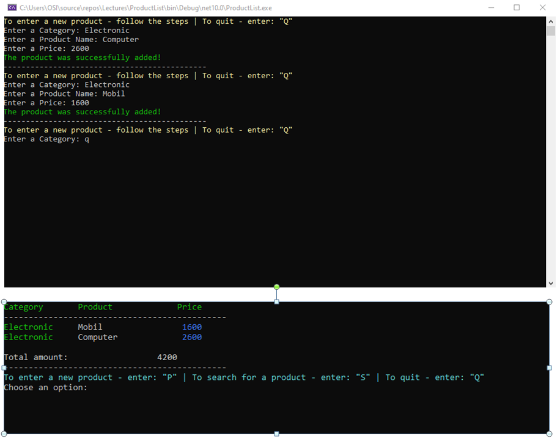

#  Product List Console App

A clean and practical C# Console Application for managing products using object-oriented programming and LINQ.

---

## 📸 Preview

<p align="center">
  
</p>

<p align="center">
  <em>Console output showing product list, sorting, total calculation, and search highlighting</em>
</p>

---

##  Overview

This project was developed as part of a C# learning program and focuses on building a structured and interactive console application.

It demonstrates:
- Object-Oriented Programming (OOP)
- LINQ for data manipulation
- Clean and user-friendly console UI design

The application allows users to add, view, sort, and search products efficiently.

---

##  Features

###  Add Products
- Input: Category, Product Name, Price  
- Continuous input until the user enters **"Q"**

---

###  Product List
- Displayed in a formatted table  
- Sorted from lowest to highest price using LINQ  
- Total price calculated and shown  

---

###  Search Function
- Search products by name  
- Matching results are highlighted in the list  

---

###  Error Handling
- Safe input handling using `TryParse`  
- Prevents invalid input and application crashes  

---

###  LINQ Usage
- Sorting → `OrderBy()`  
- Summing → `Sum()`  
- Filtering → `Where()`  

---

##  Project Structure


```
ProductListApp/
│
├── Program.cs      // Main application logic
├── Product.cs      // Product model
├── Category.cs     // Category model
├── README.md
└── screenshot.PNG
```


##  Example Usage

The user can:

- Add multiple products  
- Stop input with **"Q"**  
- View a sorted product list  
- See the total price  
- Search and highlight products  

---

## 🛠️ Technologies Used

- C#
- .NET Console Application
- LINQ

---

## ▶️ How to Run

1. Open the project in Visual Studio  
2. Build the solution  
3. Run the application  
4. Follow the instructions in the console  

---

##  Project Status

- Completed core requirements (Level 1–3)  
- Extended with search and highlight functionality  
- Clean, structured, and readable code  

---

## 👤 Author

**Osman Osmani**
